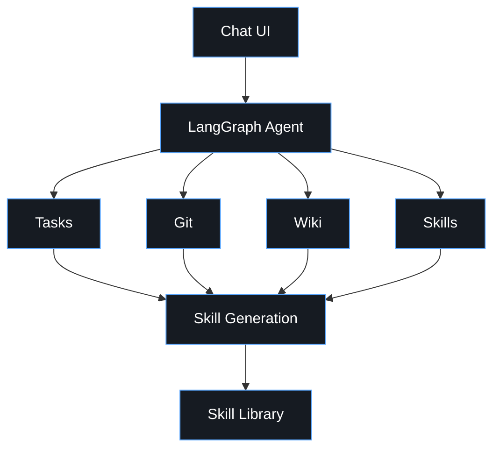

# Agent Namespace Demo

A LangGraph ReAct agent where **namespace tools** keep the interface small and functional — 4 tools instead of dozens of narrow ones; **skills** let users encode their own routine workflows on top of existing tools and replay them on demand. Since the agent only operates through tools rather than the OS, the tool set itself is the isolation boundary — no sandboxing needed.




## Tools

| Tool | Commands |
|------|----------|
| `wiki` | `search`, `read`, `list` |
| `tasks` | `list`, `get`, `save` |
| `git` | `pr`, `issue`, `repo` |
| `skills` | `list`, `get`, `save`, `delete` |


## Use Cases

Each file in `[docs/scenarios/](docs/scenarios/)` is a static message history trace — system prompt, user message, assistant tool calls, tool results, final response.


| #                                              | Scenario                                 | Demonstrates           |
| ---------------------------------------------- | ---------------------------------------- | ---------------------- |
| [01](docs/scenarios/01-list-tasks.md)          | List assigned tasks                      | basic namespace call   |
| [02](docs/scenarios/02-task-details.md)        | Get task details                         | chaining context       |
| [03](docs/scenarios/03-help-discovery.md)      | Agent discovers args via `help`          | core pattern           |
| [04](docs/scenarios/04-create-pr.md)           | Create PR from task ID                   | multi-tool chain       |
| [05](docs/scenarios/05-save-skill.md)          | Save a reusable skill                    | skills tool            |
| [06](docs/scenarios/06-reuse-skill.md)         | Agent reuses a saved skill               | skill-guided execution |
| [07](docs/scenarios/07-multi-step-workflow.md) | Full workflow: task → wiki → PR → update | end-to-end             |


## Quickstart

```bash
cp .env.example .env          # set LLM_API_KEY
uv sync
uv run python demo.py         # interactive REPL (requires LLM_API_KEY)
uv run python main.py         # static walkthrough, no API key needed
```

## Project layout

```
agent-namespace-demo/
├── demo.py                        # interactive REPL entry point
├── main.py                        # static walkthrough entry point
├── pyproject.toml
├── src/
│   └── agent_namespace_demo/
│       ├── config.py              # LLM_API_KEY, LLM_MODEL, LLM_BASE_URL
│       ├── graph.py               # LangGraph ReAct agent
│       ├── repl.py                # interactive REPL
│       ├── static_demo.py
│       └── tools/
│           ├── base.py            # NamespaceTool ABC
│           ├── wiki.py
│           ├── tasks.py
│           ├── git.py
│           └── skills.py
├── tests/
│   ├── test_wiki.py
│   ├── test_tasks.py
│   ├── test_git.py
│   └── test_skills.py
└── docs/
    ├── architecture.md
    ├── namespace-pattern.md
    └── scenarios/                 # 7 message history traces
```

