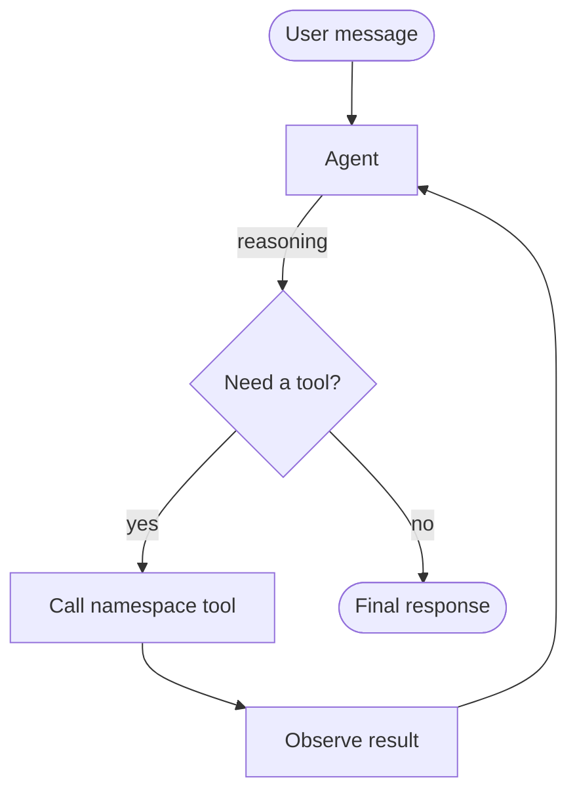
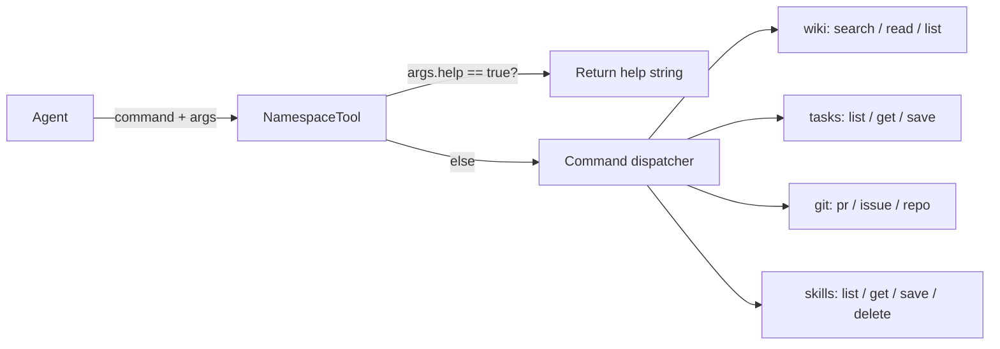

# Architecture

## Overview

The agent is built on LangGraph's `create_react_agent`, which implements the ReAct (Reasoning + Acting) loop. The agent receives a user message, reasons about what to do, calls tools, observes results, and repeats until it can respond.

## ReAct Loop

## Tool Flow

## Components

### `agent/tools/base.py`
`NamespaceTool` — abstract base class. Every tool inherits it and implements two methods:
- `_get_help(command)` — returns usage string
- `_execute_command(command, args)` — dispatches to sub-commands

### `agent/tools/*.py`
Four concrete tools, each with in-memory mock data:
- **WikiTool** — static pages dict
- **TasksTool** — mutable tasks dict (supports save/update)
- **GitTool** — mutable PRs, issues, repos lists
- **SkillsTool** — mutable skills dict, pre-seeded with one example skill

### `agent/graph.py`
Wraps each tool as a LangChain `@tool` function and passes them to `create_react_agent`. The LLM is configured from environment variables (`LLM_MODEL`, `LLM_BASE_URL`, `LLM_API_KEY`).

### `demo.py`
Interactive REPL. Maintains message history so the agent has conversation context. Prints tool calls and results in colour.

### `main.py`
Calls tools directly without a LLM — useful for verifying mock data and tool logic.
